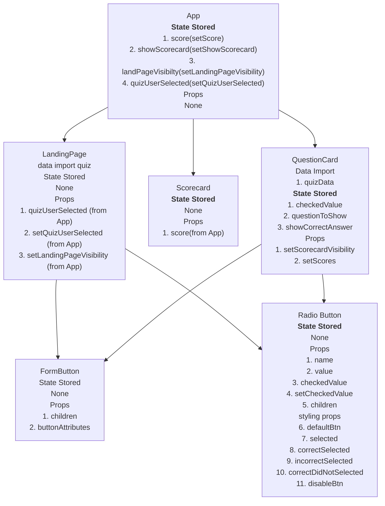

# Quiz App

## Component Hierarchy

## To do

1. Add the quiz selection (Add quiz component first).
2. User cannot select the answer after checking answer.
3. reset score after quiz
4. Add quiz component
5. Remake the component diagram and refactor

## Quiz Component

1. Loading State
2. quizToShow prop from parent
3. State quiz data fetch, question to show.

Data Import / Fetch

1. quizData
2. questionToShow
3. setScorecardVisibility
4. setScores
