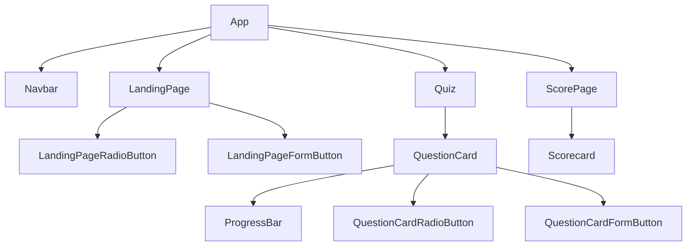

# Components

## Components Structure

### Landing Page

#### Props

| S.No | Prop Name                | Parent Component | From |
| :--- | :----------------------- | :--------------- | :--- |
| 1    | setQuizUserSelected      | App              | App  |
| 2    | setLandingPageVisibility | App              | App  |

#### State

| S.No | State Name   | Setter          |
| :--- | :----------- | :-------------- |
| 1    | checkedValue | setCheckedValue |

***

### Navbar

#### Props

| S.No | Prop Name  | Parent Component | From |
| :--- | :--------- | :--------------- | :--- |
| 1    | quizToShow | App              | App  |

#### State

None

***

### App

#### Props

None

#### State

| S.No | State Name            | Setter                   |
| :--- | :-------------------- | :----------------------- |
| 1    | quizUserSelected      | setQuizUserSelected      |
| 2    | landingPageVisibility | setLandingPageVisibility |
| 3    | showScorecard         | setShowScorecard         |

#### Ref

| S.No | ref Name |
| :--- | :------- |
| 1    | scores   |

#### Variables

| S.No | Variable Name |
| :--- | :------------ |
| 1    | quizToShow    |

***

### Quiz

#### Props

| S.No | Prop Name                                | Parent Component | From |
| :--- | :--------------------------------------- | :--------------- | :--- |
| 1    | quizToShow                               | App              | App  |
| 2    | setScorecardVisibility(setShowScorecard) | App              | App  |

#### State

| S.No | State Name     | Setter            |
| :--- | :------------- | :---------------- |
| 1    | questionToShow | setQuestionToShow |

#### Variables

| S.No | Variable Name |
| :--- | :------------ |
| 1    | quizData      |

***

### QuestionCard

#### Props

| S.No | Prop Name                             | Parent Component | From |
| :--- | :------------------------------------ | :--------------- | :--- |
| 1    | question (from quizData)              | Quiz             | Quiz |
| 2    | options (from quizData)               | Quiz             | Quiz |
| 3    | answer (from quizData)                | Quiz             | Quiz |
| 4    | scores                                | App              | Quiz |
| 5    | setScorecardVisibility                | App              | Quiz |
| 6    | noOfQuizQuestions (from quizData)     | Quiz             | Quiz |
| 7    | currentQuestionIndex (questionToShow) | Quiz             | Quiz |
| 8    | setQuestionToShow                     | Quiz             | Quiz |

#### State

| S.No | State Name        | Setter               |
| :--- | :---------------- | :------------------- |
| 1    | checkedValue      | setCheckedValue      |
| 2    | showCorrectAnswer | setShowCorrectAnswer |
| 3    | showWarning       | setShowWarning       |

***

### ProgressBar

#### Props

| S.No | Prop Name                             | Parent Component | From         |
| :--- | :------------------------------------ | :--------------- | :----------- |
| 1    | currentQuestionIndex (questionToShow) | Quiz             | QuestionCard |
| 2    | totalQuestion (noOfQuizQuestions)     | Quiz             | QuestionCard |
| 3    | className                             | QuestionCard     | QuestionCard |

#### State

None

#### Variables

| S.No | Variable Name |
| :--- | :------------ |
| 1    | width         |

***

### ScorePage

#### Props

| S.No | Prop Name                | Parent Component | From |
| :--- | :----------------------- | :--------------- | :--- |
| 1    | quizToShow               | App              | App  |
| 2    | scores                   | App              | App  |
| 3    | setQuizUserSelected      | App              | App  |
| 4    | setShowScorecard         | App              | App  |
| 5    | setLandingPageVisibility | App              | App  |

#### State

None

***

### Scorecard

#### Props

| S.No | Prop Name                     | Parent Component | From      |
| :--- | :---------------------------- | :--------------- | :-------- |
| 1    | scores                        | App              | ScorePage |
| 2    | quizUserSelected (quizToShow) | App              | ScorePage |

quizUserSelected in Scorecard component is different than that defined in App.
It is a case of duplicate naming.

#### State

None

#### Variables

| S.No | Variable Name                                            |
| :--- | :------------------------------------------------------- |
| 1    | icon (from quizUserSelect which is quizToShow)           |
| 2    | title (from quizUserSelect which is quizToShow)          |
| 3    | totalQuestions (from quizUserSelect which is quizToShow) |

***

### FormButton

#### Props

| S.No | Prop Name                          |
| :--- | :--------------------------------- |
| 1    | children                           |
| 2    | className                          |
| 3    | buttonAttributes (rest parameters) |

#### State

None

***

### RadioButton

This button is to be used in the form.
As it returns the radio button, it need name prop.

#### Props

| S.No | Prop Name             |
| :--- | :-------------------- |
| 1    | name                  |
| 2    | value                 |
| 3    | checkedValue          |
| 4    | setCheckedValue       |
| 5    | children              |
| 6    | defaultBtn            |
| 7    | selected              |
| 8    | correctSelected       |
| 9    | incorrectSelected     |
| 10   | correctDidNotSelected |
| 11   | disableBtn            |

Only one of defaultBtn, selected, correctSelected,
incorrectSelected, correctDidNotSelected, disableBtn can be selected at a time.

#### State

None

***

## Component Hierarchy

