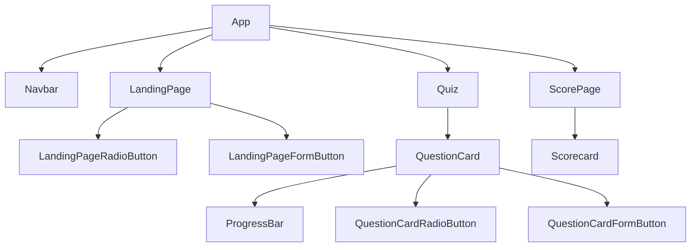

# Components

## Components Structure

### Landing Page

#### Props

None

#### State

| S.No | State Name   | Setter          |
| :--- | :----------- | :-------------- |
| 1    | checkedValue | setCheckedValue |

#### Context Variables

| S.No | Variable Name            |
| :--- | :----------------------- |
| 1    | setQuizUserSelected      |
| 2    | setLandingPageVisibility |

---

### Navbar

#### Props

None

#### State

None

#### Context Variables

| S.No | Variable Name |
| :--- | :------------ |
| 1    | quizData      |

---

### App

#### Props

None

#### State

None

#### Context Variables

| S.No | Variable Name         |
| :--- | :-------------------- |
| 1    | landingPageVisibility |
| 2    | scorePageVisibility   |

---

### Quiz

#### Props

None

#### State

| S.No | State Name           | Setter                  |
| :--- | :------------------- | :---------------------- |
| 1    | currentQuestionIndex | setCurrentQuestionIndex |

#### Variables

| S.No | Variable Name                          |
| :--- | :------------------------------------- |
| 1    | quizQuestions (from quizData)          |
| 2    | noOfQuizQuestions (from quizQuestions) |
| 3    | question (from quizQuestions)          |
| 4    | options (from quizQuestions)           |
| 5    | answer (from quizQuestions)            |

#### Context Variables

| S.No | Variable Name |
| :--- | :------------ |
| 1    | quizData      |

---

### QuestionCard

#### Props

| S.No | Prop Name            | Parent Component | From |
| :--- | :------------------- | :--------------- | :--- |
| 1    | question             | Quiz             | Quiz |
| 2    | options              | Quiz             | Quiz |
| 3    | answer               | Quiz             | Quiz |
| 4    | setQuestionToShow    | Quiz             | Quiz |
| 5    | noOfQuizQuestions    | Quiz             | Quiz |
| 6    | currentQuestionIndex | Quiz             | Quiz |

#### State

| S.No | State Name        | Setter               |
| :--- | :---------------- | :------------------- |
| 1    | checkedValue      | setCheckedValue      |
| 2    | showCorrectAnswer | setShowCorrectAnswer |
| 3    | showWarning       | setShowWarning       |

#### Context Variable

| S.No | Variable Name          |
| :--- | :--------------------- |
| 1    | setScorePageVisibility |
| 2    | userScores             |

---

### ProgressBar

#### Props

| S.No | Prop Name            | Parent Component | From         |
| :--- | :------------------- | :--------------- | :----------- |
| 1    | currentQuestionIndex | Quiz             | QuestionCard |
| 2    | noOfQuizQuestions    | Quiz             | QuestionCard |
| 3    | className            | QuestionCard     | QuestionCard |

#### State

None

#### Variables

| S.No | Variable Name |
| :--- | :------------ |
| 1    | width         |

---

### ScorePage

#### Props

None

#### State

None

#### Context Variables

| S.No | Variable Name            |
| :--- | :----------------------- |
| 1    | userScores               |
| 2    | setQuizUserSelected      |
| 3    | setScorePageVisibility   |
| 4    | setLandingPageVisibility |

---

### Scorecard

#### Props

None

#### State

None

#### Context Variables

| S.No | Variable Name |
| :--- | :------------ |
| 1    | quizData      |
| 2    | userScores    |

#### Variables

| S.No | Variable Name                  |
| :--- | :----------------------------- |
| 1    | quizIcon (from quizData)       |
| 2    | quizTitle (from quizData)      |
| 3    | totalQuestions (from quizData) |

---

### FormButton

#### Props

| S.No | Prop Name                          |
| :--- | :--------------------------------- |
| 1    | children                           |
| 2    | className                          |
| 3    | buttonAttributes (rest parameters) |

#### State

None

---

### RadioButton

This button is to be used in the form.
As it returns the radio button, it need name prop.

#### Props

| S.No | Prop Name             |
| :--- | :-------------------- |
| 1    | name                  |
| 2    | value                 |
| 3    | checkedValue          |
| 4    | setCheckedValue       |
| 5    | children              |
| 6    | defaultBtn            |
| 7    | selected              |
| 8    | correctSelected       |
| 9    | incorrectSelected     |
| 10   | correctDidNotSelected |
| 11   | disableBtn            |

Only one of defaultBtn, selected, correctSelected,
incorrectSelected, correctDidNotSelected, disableBtn can be selected at a time.

#### State

None

---

## Component Hierarchy

